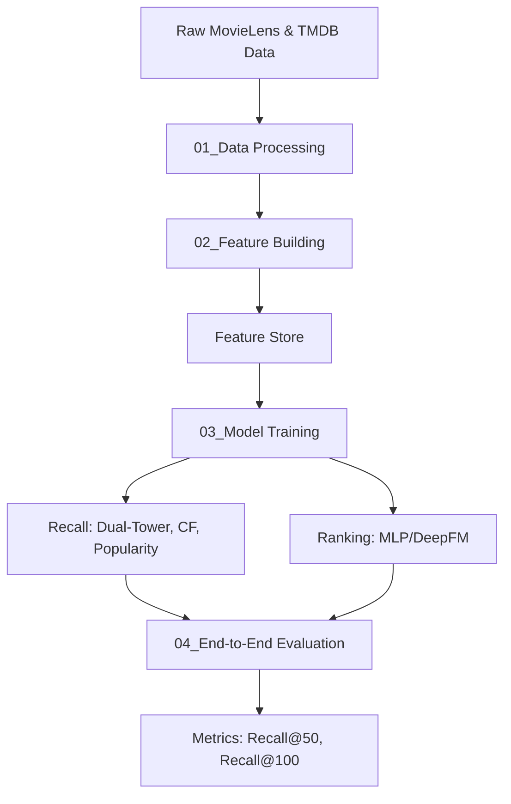

# MovieLens-Rec-V2: 工业级电影推荐系统实战

本项目是一个基于 MovieLens-32M 数据集和 TMDB/IMDB 元数据的工业级推荐系统。项目实现了完整的“召回 -> 排序”流水线，重点展示了双塔模型 (Dual-Tower)、多路召回融合以及端到端评估链路。

## 🚀 核心特性

- **多路召回 (Multi-Channel Recall)**:
    - **双塔模型 (Dual-Tower)**: 深度语义匹配，支持 In-batch 负采样、Log-Q 纠偏和 Time-Decay 时序感知。
    - **协同过滤 (CF)**: 包含 ItemCF 和 UserCF。
    - **统计类召回**: 热门物品召回、基于标签 (Tags) 的召回。
- **排序模型 (Ranking)**:
    - **精排架构**: 支持 MLP (Multilayer Perceptron) 与 DeepFM。
    - **预估目标**: 点击率 (CTR) 预估或评分 (Rating) 回归。
    - **特征交叉**: 用户侧、物品侧及上下文特征的深度交叉。
- **特征工程 (Feature Engineering)**:
    - 针对长尾分布 (如票房、评分数) 的 **Log 变换**。
    - 针对 Release Year 等连续特征的 **分箱 (Binning)**。
    - **User/Item Profile**: 动静分离的特征存储设计。
- **工程标准 (Engineering Excellence)**:
    - 全流程 **Parquet** 存储中间数据，优化 IO 性能。
    - **Pandas 向量化** 操作，严禁逐行循环，处理千万级数据更高效。
    - **FAISS 索引**: 模拟真实线上全量向量检索性能。

## 🏗️ 系统架构



## 📂 项目结构

```text
├── data/                      # 数据目录 (Parquet 格式存储)
│   ├── raw/                   # 原始数据 (MovieLens-32M, TMDB)
│   ├── processed/             # 处理后的训练/验证/测试集
│   └── feature_store/         # 模拟线上的特征快照
├── src/                       # 核心源代码
│   ├── data_pipeline/         # 数据清洗与 Preprocessing
│   ├── features/              # 特征编码与工程
│   ├── models/                # 召回与排序模型实现
│   └── pipeline/              # 召回器、排序器、特征拉取组件
├── scripts/                   # 一键执行流水线脚本
│   ├── 00_prepare_tmdb.py     # 准备 TMDB 特征
│   ├── 01_process_data.py     # 运行清洗与切分
│   ├── 02_build_features.py   # 生成并存储特征库
│   ├── 03_train_models.py     # 触发模型训练 (召回+排序)
│   └── 04_evaluate_e2e.py     # 执行端到端评测
└── docs/                      # 设计文档与技术规范
```

## 🛠️ 环境准备

项目必须使用 Conda 环境 `movielens-rec` 进行开发与运行。

```bash
# 创建环境
conda create -n movielens-rec python=3.10 -y
conda activate movielens-rec

# 安装依赖
pip install -r requirements.txt
```

## 🏃 使用说明

请按照脚本编号顺序执行以下步骤：

1.  **准备 TMDB 缓存数据**:
    ```bash
    conda run -n movielens-rec python scripts/00_prepare_tmdb.py
    ```
2.  **数据清洗与切分**:
    ```bash
    conda run -n movielens-rec python scripts/01_process_data.py
    ```
3.  **特征工程**:
    ```bash
    conda run -n movielens-rec python scripts/02_build_features.py
    ```
4.  **模型训练**:
    ```bash
    conda run -n movielens-rec python scripts/03_train_models.py
    ```
5.  **端到端评估**:
    ```bash
    conda run -n movielens-rec python scripts/04_evaluate_e2e.py
    ```

## 📊 评估标准

本项目主要关注召回阶段与精排阶段的离线指标：
- **召回阶段**: Recall@50 / Recall@100，衡量候选集覆盖率。
- **排序阶段**: AUC, LogLoss, RMSE，衡量点击或评分预估准确性。
- **性能模拟**: FAISS Latency，评估向量索引检索在高并发下的性能表现。

## 🎯 排序模型 (Ranking Model)

在多路召回融合后，我们对 Top 500 的候选集进行精排：
- **特征拉取**: 从 `feature_store` 动态获取 User/Item 的稠密向量与稀疏特征。
- **特征生成**: 构造交叉特征（如 User-Genre Match、History-Item Similarity）。
- **模型推理**: 使用训练好的精排模型进行打分，并根据打分进行最终重排。

## 📜 开发者指南

- **数据防穿越**: 所有用户特征必须基于 `train_data` 计算，严禁使用验证集/测试集信息。
- **双塔模型细节**: 
    - User/Item 塔 ID Embedding **强共享**。
    - 采用 `InfoNCE + BPR` 混合损失函数。
    - 实现 `Log-Q Correction` 消除热度偏置。
- **提交规范**: 采用 **原子化提交 (Atomic Commits)**，确保每次 Commit 仅对应一个功能或修复。
